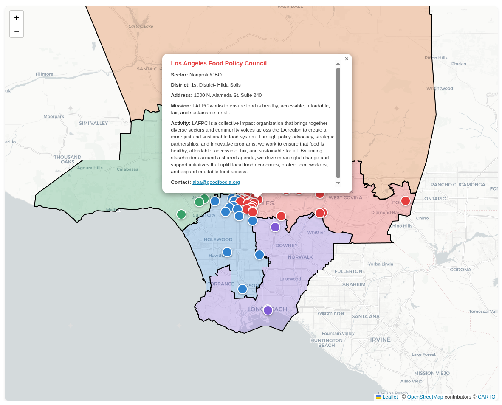

# LA Food Systems Map



An interactive web application that visualizes food systems stakeholders across Los Angeles County. This map provides insights into the organizations, activities, and networks that make up LA's food ecosystem based on comprehensive survey data.

## Features

- ✅ Interactive map visualization of food systems organizations
- ✅ Advanced search and filtering capabilities
- ✅ Data visualizations for activities, capacity, challenges, and goals
- ✅ Geographic analysis by supervisorial districts
- ✅ Network relationship mapping
- ✅ Responsive design for desktop and mobile
- ✅ Built with modern web technologies (Astro, JavaScript, CSS)

## About the Data

This application visualizes data from the "Food Systems Stakeholder Survey" which collected responses from organizations across Los Angeles County involved in various aspects of the food system - from production and distribution to policy and advocacy.

## 🚀 Project Structure

The application is built with Astro and includes several key components:

```
/
├── public/
│   ├── data/
│   │   └── organizations.json          # Processed survey data
│   ├── images/
│   │   └── Screenshot.png             # Application preview
│   └── FINAL- Food Systems Stakeholder Survey (Responses).xlsx
├── src/
│   ├── components/
│   │   ├── MapContainer.astro         # Main interactive map
│   │   ├── SearchFilters.astro        # Search and filter controls
│   │   ├── Header.astro               # Site header
│   │   └── Footer.astro               # Site footer
│   ├── pages/
│   │   ├── index.astro                # Main map page
│   │   └── dashboard-simple.astro     # Data dashboard
│   ├── scripts/
│   │   ├── processData.js             # Data processing utilities
│   │   └── geocode.js                 # Geocoding functionality
│   └── styles/
│       └── global.css                 # Application styles
```

## 🧞 Commands

All commands are run from the root of the project, from a terminal:

| Command                           | Action                                           |
| :-------------------------------- | :----------------------------------------------- |
| `npm install`                     | Installs dependencies                            |
| `npm run dev`                     | Starts local dev server at `localhost:4321`      |
| `npm run build`                   | Build your production site to `./dist/`          |
| `npm run preview`                 | Preview your build locally, before deploying     |
| `npm run astro ...`               | Run CLI commands like `astro add`, `astro check` |
| `npm run astro -- --help`         | Get help using the Astro CLI                     |

## Getting Started

1. Clone this repository
2. Install dependencies with `npm install`
3. Start the development server with `npm run dev`
4. Open your browser to `localhost:4321`

## Data Processing

The application includes scripts to process the raw survey data:

- `src/scripts/processData.js` - Converts Excel survey responses to JSON format
- `src/scripts/geocode.js` - Adds geographic coordinates to organization addresses

## 👀 Want to learn more?

This project uses [Astro](https://astro.build) as the web framework. Check out the [Astro documentation](https://docs.astro.build) to learn more about the technology stack.
